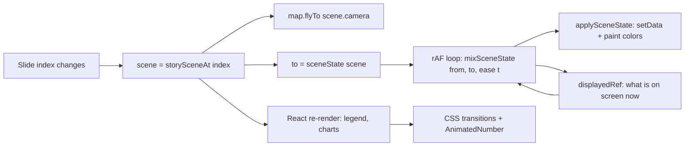

# Story map transitions — developer guide

How the Story view animates between slides: the camera move, the columns and disks reshaping on the map, their color changes, and the legend, charts and numbers that follow along. The last section is a recipe for reusing the same technique elsewhere.

Source files (all under `src/llumen-assistant/story/`):

| File | What it owns |
| --- | --- |
| `storyDemoScenes.ts` | Scene definitions per slide, `sceneState`, `mixSceneState`, color ramp, `sceneAtPhase` |
| `StoryMap.tsx` | Mapbox map, camera `flyTo`, the tween loop, writing each frame to the map |
| `StoryCharts.tsx` | `useTweenedNumber` / `AnimatedNumber`, `warpPath`, chart components |
| `StoryView.module.css` | CSS transitions for chart paths, bars, legend colors |
| `storyTimeline.ts`, `StoryTimeSeries.tsx` | Per-slide time series that drives frame-by-frame transitions |

---

## 1. The idea in one paragraph

Every slide is described by a **scene**: a camera, rules for how tall and what color each column is, how big each disk is, and the numbers for the charts. When the slide changes, we compute a flat **state snapshot** for the new scene (plain arrays of numbers), then run one `requestAnimationFrame` loop that **interpolates** from what is currently on screen to that snapshot and writes each in-between frame to the map. The camera moves separately with Mapbox's own `flyTo`. The side panel (legend, charts, numbers) animates with CSS transitions and a small number tween, timed to land together with the map.



---

## 2. Timings at a glance

| What | Duration | Easing | Mechanism |
| --- | --- | --- | --- |
| Camera (center, zoom, pitch, bearing) | 2600 ms | Mapbox `flyTo`, `curve: 1.2` | `map.flyTo` |
| Column heights, column colors, disk radii, disk colors (slide change) | 1800 ms | `easeInOutCubic` | rAF tween in `StoryMap.tsx` |
| Same, time-series frame while playing | one step (see §8) | linear | rAF tween |
| Same, time-series frame when scrubbing/paused | 500 ms | `easeInOutCubic` | rAF tween |
| Chart lines and areas (SVG path morph) | 900 ms | `cubic-bezier(0.4, 0, 0.2, 1)` | CSS `transition: d` |
| Split bar (terrestrial / marine) | 900 ms | `cubic-bezier(0.4, 0, 0.2, 1)` | CSS `transition: flex-grow` |
| Legend colors (disk ring, disk scale, column glyphs) | 900 ms | `ease` | CSS `transition` on colors / `fill` |
| Monitoring site bars (online/offline) | 600 ms | `ease` | CSS `transition: background-color` |
| Counters (e.g. 14,200 → 16,363) | 900 ms | ease-out cubic | `useTweenedNumber` |

The map data tween (1.8 s) finishes inside the camera move (2.6 s), so values settle while the camera is still easing in. Panel animations (0.9 s) finish first, so the reader sees the new numbers early.

---

## 3. Scenes and state snapshots

A scene is the authored description of a slide (`storyDemoScenes.ts`):

```ts
export type StoryScene = {
  camera: { center: [number, number]; zoom: number; pitch: number; bearing: number }
  /** Height (meters) → color stops for the columns. */
  columnRamp: [number, string][]
  columnHeight: (lng: number, lat: number, baseHeight: number, index: number) => number
  diskCore: string
  diskHalo: string
  diskRadius: (lng: number, lat: number, baseRadius: number, index: number) => number
  legend: { /* colors + junctionCount for the Map Data panel */ }
  insight: { /* numbers and path warps for the left-panel charts */ }
}
```

The scene uses **functions** (height and radius per point) so a slide can express patterns: a heat corridor, hotspots, noise. Functions can't be interpolated, so before animating we evaluate them into a **snapshot** of plain numbers:

```ts
export type StorySceneState = {
  heights: number[]                       // one per column
  columnColors: [number, number, number][] // RGB per column
  radii: number[]                          // one per disk
  diskCore: [number, number, number]
  diskHalo: [number, number, number]
}

export function sceneState(scene: StoryScene): StorySceneState {
  const heights = DEMO_COLUMNS.map(([lng, lat, base], index) => scene.columnHeight(lng, lat, base, index))
  return {
    heights,
    columnColors: heights.map((height) => rampColor(scene.columnRamp, height)),
    radii: DEMO_JUNCTIONS.map(([lng, lat, base], index) => scene.diskRadius(lng, lat, base, index)),
    diskCore: hexToRgb(scene.diskCore),
    diskHalo: hexToRgb(scene.diskHalo),
  }
}
```

Key rule: **both snapshots must have the same shape** (same number of columns and disks, same order). All slides share the same point positions (`storyDemoMapData.ts`); only heights, radii and colors change. That is what makes every column "grow" into its new value instead of popping in or out.

---

## 4. The interpolation (mix) functions

Linear interpolation per number, and per RGB channel for colors:

```ts
function mix(a: number, b: number, t: number) {
  return a + (b - a) * t
}

function mixRgb(a: [number, number, number], b: [number, number, number], t: number): [number, number, number] {
  return [mix(a[0], b[0], t), mix(a[1], b[1], t), mix(a[2], b[2], t)]
}

export function mixSceneState(from: StorySceneState, to: StorySceneState, t: number): StorySceneState {
  return {
    heights: from.heights.map((height, index) => mix(height, to.heights[index], t)),
    columnColors: from.columnColors.map((color, index) => mixRgb(color, to.columnColors[index], t)),
    radii: from.radii.map((radius, index) => mix(radius, to.radii[index], t)),
    diskCore: mixRgb(from.diskCore, to.diskCore, t),
    diskHalo: mixRgb(from.diskHalo, to.diskHalo, t),
  }
}
```

`t` is the eased progress from 0 to 1. Easing happens outside, so the same mix works for any curve.

---

## 5. The color transition

Colors change in two ways at once, and both come out of the same tween:

1. **Each slide has its own palette.** Slide 1 is a blue→cyan ramp, slide 2 red→yellow, slide 3 purple→pink. Disks have their own core and halo color per slide.
2. **Column color depends on column height.** `rampColor` finds the two ramp stops around a height and blends them:

```ts
function rampColor(ramp: [number, string][], height: number): [number, number, number] {
  if (height <= ramp[0][0]) return hexToRgb(ramp[0][1])
  for (let i = 1; i < ramp.length; i += 1) {
    const [stop, color] = ramp[i]
    if (height <= stop) {
      const [prevStop, prevColor] = ramp[i - 1]
      const t = (height - prevStop) / (stop - prevStop)
      const a = hexToRgb(prevColor)
      const b = hexToRgb(color)
      return [a[0] + (b[0] - a[0]) * t, a[1] + (b[1] - a[1]) * t, a[2] + (b[2] - a[2]) * t]
    }
  }
  return hexToRgb(ramp[ramp.length - 1][1])
}
```

The target color for each column is computed **once** in `sceneState` (from the target height and the target ramp). During the tween we blend the **old RGB into the new RGB** directly; we do not re-run the ramp on the in-between height. This way a column crossfades from "blue palette, short" to "red palette, tall" in one smooth path, rather than walking through the new ramp's colors on the way up.

Colors are written to the map as a per-feature property and read with an expression:

```ts
'fill-extrusion-color': ['to-color', ['get', 'color']],
'fill-extrusion-height': ['get', 'height'],
```

Disk colors are layer-wide, so they're written with `setPaintProperty` every frame. Mapbox's own paint transition is turned **off** for those, so it doesn't lag behind our tween:

```ts
'circle-color-transition': { duration: 0 },
```

> Tip for other areas: RGB mixing is simple and looks fine for these palettes. If a transition passes through a muddy gray (for example blue → orange), mix in OKLab or HSL instead; only `mixRgb` needs to change.

---

## 6. The tween loop (`StoryMap.tsx`)

```ts
const displayedRef = useRef<StorySceneState>(sceneState(sceneAtPhase(storySceneAt(sceneIndex), framePhase)))
const tweenRef = useRef<number | null>(null)

useEffect(() => {
  const map = mapRef.current
  if (!map || !ready) return
  const sceneChanged = appliedSceneRef.current !== sceneIndex
  if (!sceneChanged && appliedPhaseRef.current === framePhase) return
  appliedSceneRef.current = sceneIndex
  appliedPhaseRef.current = framePhase

  const scene = storySceneAt(sceneIndex)
  if (sceneChanged) {
    map.flyTo({ ...scene.camera, duration: CAMERA_DURATION_MS, curve: 1.2, essential: true })
  }

  if (tweenRef.current !== null) cancelAnimationFrame(tweenRef.current)
  const from = displayedRef.current
  const to = sceneState(sceneAtPhase(scene, framePhase))
  const duration = sceneChanged ? SCENE_TWEEN_MS : Math.max(1, frameDuration)
  const ease = !sceneChanged && frameLinear ? (t: number) => t : easeInOutCubic
  const start = performance.now()
  const step = (now: number) => {
    const t = Math.min(1, (now - start) / duration)
    displayedRef.current = mixSceneState(from, to, ease(t))
    applySceneState(map, displayedRef.current)
    tweenRef.current = t < 1 ? requestAnimationFrame(step) : null
  }
  tweenRef.current = requestAnimationFrame(step)
}, [sceneIndex, framePhase, frameDuration, frameLinear, ready])
```

Why it's built this way:

- **`from` is what's on screen, not the previous scene.** `displayedRef` always holds the last frame drawn. If the user clicks Next twice quickly, the second tween starts from wherever the first one had reached, so there's never a jump.
- **One loop at a time.** Any running tween is cancelled before starting a new one.
- **Refs, not React state, per frame.** Frames never re-render React; they go straight to Mapbox. React only decides *when* a transition starts.
- **The camera is independent.** `flyTo` runs on Mapbox's own clock (2.6 s). The data tween (1.8 s) runs alongside it. They don't need to be synchronized frame by frame.

Writing a frame:

```ts
function applySceneState(map: mapboxgl.Map, state: StorySceneState) {
  const columns = map.getSource('story-columns') as mapboxgl.GeoJSONSource | undefined
  const junctions = map.getSource('story-junctions') as mapboxgl.GeoJSONSource | undefined
  columns?.setData(columnData(state))   // height + color per column
  junctions?.setData(junctionData(state)) // radius per disk
  if (map.getLayer('story-junctions')) {
    map.setPaintProperty('story-junctions', 'circle-color', rgbString(state.diskCore))
    map.setPaintProperty('story-junctions-halo', 'circle-color', rgbString(state.diskHalo))
  }
}
```

Column geometry (the little polygons) is built **once** (`COLUMN_GEOMETRY`); only properties change per frame, which keeps `setData` cheap.

Easing used for slide changes:

```ts
function easeInOutCubic(t: number) {
  return t < 0.5 ? 4 * t * t * t : 1 - (-2 * t + 2) ** 3 / 2
}
```

### Disks sized in meters

Disk radius is stored in **meters**, and the circle layer converts meters to pixels for the current zoom, so disks stay glued to the ground while the camera zooms and pitches during `flyTo`:

```ts
const METERS_PER_PX_Z0 = (40075016.686 / 512) * Math.cos((24.47 * Math.PI) / 180)

function metersToPixels(scale: number): mapboxgl.ExpressionSpecification {
  const base = ['/', ['*', ['get', 'radius'], scale], METERS_PER_PX_Z0]
  return ['interpolate', ['exponential', 2], ['zoom'], 0, base, 22, ['*', base, 2 ** 22]]
}
// core: metersToPixels(1), halo: metersToPixels(1.7)
// plus 'circle-pitch-alignment': 'map', 'circle-pitch-scale': 'map'
```

Without this, disks would change size on screen during the camera move, which reads as an unwanted second animation.

### Surviving a basemap style change

When the background style changes, Mapbox drops all sources and layers. On `style.load` we re-mount the layers from `displayedRef.current`, so the overlay comes back exactly as it was, even mid-tween.

---

## 7. Camera

```ts
const CAMERA_PADDING = { top: 0, right: 0, bottom: 0, left: 400 }
const CAMERA_DURATION_MS = 2600

map.setPadding(CAMERA_PADDING)
map.flyTo({ ...scene.camera, duration: CAMERA_DURATION_MS, curve: 1.2, essential: true })
```

- Each scene sets `center`, `zoom`, `pitch` and `bearing`. `flyTo` animates all four together, so the view rotates, tilts and travels in one arc.
- `curve: 1.2` keeps the zoom-out-and-back-in arc gentle (Mapbox's default is 1.42, which feels jumpy for short hops).
- `essential: true` keeps the animation for users with reduced-motion settings in Mapbox; change it to `false` in areas where motion should respect that preference.
- The left padding of 400 px keeps the subject clear of the insight panel, so "center" means the visible part of the map.
- "Reset north" eases back to the scene's own `pitch` and `bearing` (420 ms), not to 0/0, so it returns to the authored angle.

---

## 8. Time-series frames (same engine, no camera)

The time series reuses the exact same tween. Instead of switching scenes, it changes a **phase** from 0 to 1 within the current slide:

```ts
export function sceneAtPhase(scene: StoryScene, phase: number): StoryScene {
  if (phase === 0) return scene
  const a = Math.sin(2 * Math.PI * phase)
  const b = Math.sin(4 * Math.PI * phase)
  // column heights, disk radii, legend count and chart numbers are scaled by a and b
}
```

- Phase 0 is the authored slide. Because the modulation uses `sin`, the last frame flows back into the first without a jump when the loop wraps.
- Frame changes **don't** call `flyTo` (only `sceneChanged` does), so the camera stays put.
- While playing, each frame tweens **linearly** over exactly one step, so consecutive frames join into one continuous motion. When scrubbing or paused, a frame eases over 500 ms.
- Step length at 1× is `clamp(20000 / frameCount, 250, 1600)` ms, divided by the playback speed.

---

## 9. The side panel (legend, charts, numbers)

The panel re-renders with the new slide's values, and CSS carries the change.

**Chart lines morph** with the CSS `d` property:

```css
.chartPath {
  transition: d 900ms cubic-bezier(0.4, 0, 0.2, 1);
}
```

```tsx
<path className={styles.chartPath} d={line} style={{ d: `path('${line}')` } as CSSProperties} />
```

A path can only morph if the old and new paths have **the same commands in the same order**. So each chart has one traced base path, and each slide supplies a `warp(x, y)` function that only moves y values. `warpPath` rewrites numbers but keeps every `M` / `C` intact:

```ts
export function warpPath(path: string, warp: (x: number, y: number) => number) {
  let index = 0
  let x = 0
  return path.replace(/-?\d+(?:\.\d+)?/g, (token) => {
    const value = Number(token)
    const out = index % 2 === 0 ? (x = value) : warp(x, value)
    index += 1
    return out.toFixed(2)
  })
}
```

> Browser note: CSS transitions on `d` work in Chromium and Firefox. Browsers without support show the new line immediately; nothing breaks.

**Bars and colors:**

```css
.splitTerrestrial, .splitMarine { transition: flex-grow 900ms cubic-bezier(0.4, 0, 0.2, 1); }
.siteOn, .siteOff               { transition: background-color 600ms ease; }
.diskOther                      { transition: border-color 900ms ease, background-color 900ms ease; }
.diskScale i                    { transition: background-color 900ms ease; }
.columnGlyph *                  { transition: fill 900ms ease; }
```

The split bar gets its proportions from `style={{ flexGrow: value }}`, so the bar slides to the new ratio. Legend glyph colors are set as inline `fill` styles (not SVG attributes), which lets the CSS transition pick them up.

**Numbers count up/down** with a small hook (ease-out cubic, 900 ms). It starts from the currently displayed value, so it's interruptible like the map tween:

```ts
function useTweenedNumber(value: number, durationMs = 900) {
  const [display, setDisplay] = useState(value)
  const displayRef = useRef(value)
  useEffect(() => {
    const from = displayRef.current
    if (from === value) return
    const start = performance.now()
    let frame = 0
    const step = (now: number) => {
      const t = Math.min(1, (now - start) / durationMs)
      const next = from + (value - from) * (1 - (1 - t) ** 3)
      displayRef.current = next
      setDisplay(next)
      if (t < 1) frame = requestAnimationFrame(step)
    }
    frame = requestAnimationFrame(step)
    return () => cancelAnimationFrame(frame)
  }, [value, durationMs])
  return display
}

<AnimatedNumber value={insight.terrestrial} format={formatCount} />
```

---

## 10. Reusing this in another area

The technique is independent of Mapbox. Any visual that can be described as "N numbers and colors" can use it.

### Step by step

1. **Define the states.** Pick the fixed set of things that change (positions, sizes, colors) and make every state a snapshot with the **same shape**. Keep authoring logic (rules, functions) separate from the snapshot.
2. **Write `mix(from, to, t)`.** Numbers: `a + (b - a) * t`. Colors: per channel. Arrays: element by element.
3. **Keep a "displayed" ref.** Always tween from what's on screen, never from the previous target.
4. **Run one rAF loop.** Cancel the old loop before starting a new one. Apply each frame imperatively (canvas, WebGL, map source, or DOM styles), not through React state.
5. **Move the viewpoint separately.** Camera or scroll position gets its own animation and duration, usually a bit longer than the data tween.
6. **Let the UI follow with CSS.** Colors, widths and SVG paths transition in CSS; numbers use `useTweenedNumber`. Aim for the UI to land slightly before the main visual.
7. **Turn off built-in transitions** on anything you drive per frame (Mapbox `*-transition: { duration: 0 }`, CSS `transition: none`), or the two animations fight.

### A reusable tween helper

```ts
type Mix<S> = (from: S, to: S, t: number) => S

export const easeInOutCubic = (t: number) => (t < 0.5 ? 4 * t * t * t : 1 - (-2 * t + 2) ** 3 / 2)
export const linear = (t: number) => t

/** Interruptible tween: always starts from the last drawn state. */
export function createTween<S>(initial: S, mix: Mix<S>, apply: (state: S) => void) {
  let displayed = initial
  let frame: number | null = null

  return {
    get state() {
      return displayed
    },
    to(target: S, duration: number, ease = easeInOutCubic) {
      if (frame !== null) cancelAnimationFrame(frame)
      const from = displayed
      const start = performance.now()
      const step = (now: number) => {
        const t = Math.min(1, (now - start) / Math.max(1, duration))
        displayed = mix(from, target, ease(t))
        apply(displayed)
        frame = t < 1 ? requestAnimationFrame(step) : null
      }
      frame = requestAnimationFrame(step)
    },
    cancel() {
      if (frame !== null) cancelAnimationFrame(frame)
      frame = null
    },
  }
}
```

Example for a different Mapbox layer:

```ts
type HeatState = { weights: number[]; color: [number, number, number] }

const mixHeat: Mix<HeatState> = (a, b, t) => ({
  weights: a.weights.map((w, i) => w + (b.weights[i] - w) * t),
  color: [0, 1, 2].map((c) => a.color[c] + (b.color[c] - a.color[c]) * t) as [number, number, number],
})

const heat = createTween(initialHeat, mixHeat, (state) => {
  source.setData(toFeatures(state.weights))
  map.setPaintProperty('heat', 'circle-color', `rgb(${state.color.map(Math.round).join(',')})`)
})

// on step change:
map.flyTo({ ...camera, duration: 2600, curve: 1.2 })
heat.to(nextHeat, 1800)
```

### Checklist

- [ ] Same number of elements, same order, in every state
- [ ] Tween starts from the displayed state (interruptible)
- [ ] One active animation loop per visual; cancel on unmount
- [ ] Per-frame updates bypass React
- [ ] Built-in transitions disabled on driven properties
- [ ] Sizes on a map expressed in meters if they must stay glued to the ground during camera moves
- [ ] Camera duration ≥ data tween duration; UI transitions shorter still
- [ ] Linear easing for continuous playback, ease-in-out for one-off changes
- [ ] Consider `prefers-reduced-motion`: shorten durations or jump directly

---

## 11. Pitfalls we hit

- **Tweening from the previous target instead of the displayed state** causes visible jumps on fast clicks. Always read `displayedRef.current`.
- **Mixing colors through the ramp** (re-evaluating the ramp on the in-between height) makes colors flicker through the wrong palette. Blend final RGB values instead.
- **Mapbox paint transitions** (default 300 ms) on a property you also set every frame make it lag and wobble. Set the transition duration to 0.
- **Path morph silently fails** if two paths have different command counts. Generate variants from one base path.
- **Style reloads drop layers.** Re-mount from the displayed state on `style.load`.
- **Heavy `setData` per frame:** build geometry once and only change properties. For thousands of features, move the per-frame values into feature-state (for paint properties that support it) or a custom WebGL layer instead.
